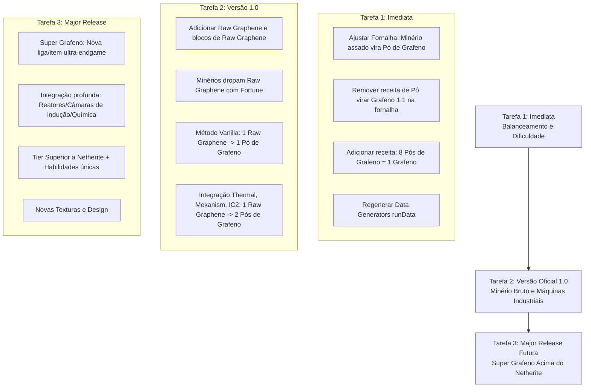

# Documentação do Mod Graphene Extension & Roadmap de Desenvolvimento

## 1. Documentação do Mod (Estado Atual)

### Visão Geral Técnica
- **Mod ID:** `grapheneextension`
- **Nome do Mod:** `GrapheneExtension`
- **Versão Atual:** `1.20.1-0.1.0` (Padrão CurseForge: `[Versão MC]-[Versão Mod]`, Forge `47.2.30`)
- **Mapeamentos:** Parchment `2023.09.03-1.20.1` (Java 17)
- **Pacote Base:** `net.ale.grapheneextension`
- **Arquitetura de Dados:** Utiliza o sistema de **Data Generators** do Forge (`runData`), gerando receitas, loot tables, tags, modelos e geração de mundo automaticamente em `src/generated/resources`.

---

### Estrutura do Código e Pacotes

```text
net.ale.grapheneextension/
├── GrapheneExtension.java      # Classe principal do mod, registro de barramentos e abas criativas
├── Config.java                 # Configurações do Forge (estrutura padrão de template)
├── block/
│   └── ModBlocks.java          # Registro de todos os blocos e BlockItems
├── item/
│   ├── ModItems.java           # Registro de itens, ferramentas e armaduras
│   ├── ModToolTiers.java       # Tier de ferramentas (ForgeTier / TierSortingRegistry)
│   ├── ModArmorMaterials.java  # Material de armadura personalizado (ArmorMaterial)
│   └── ModCreativeModTabs.java # Aba criativa personalizada do mod ("Graphene Extension")
├── worldgen/
│   ├── ModConfiguredFeatures.java # Configuração dos veios de minério por dimensão
│   ├── ModPlacedFeatures.java     # Alturas e quantidade de veios por chunk
│   ├── ModBiomeModifiers.java     # Injeção dos minérios nos biomas do Overworld, Nether e End
│   └── ModOrePlacement.java       # Utilitários de modificadores de colocação de minérios
├── datagen/                    # Provedores de geração de dados Forge (receitas, modelos, tags, loot)
│   ├── DataGenerators.java
│   ├── ModRecipeProvider.java
│   ├── ModLootTableProvider.java / loot/ModBlockLootTables.java
│   ├── ModBlockStateProvider.java
│   ├── ModItemModelProvider.java
│   ├── ModBlockTagGenerator.java
│   ├── ModItemTagGenerator.java
│   └── ModWorldGenProvider.java
└── util/
    └── ModTags.java            # Chaves de tags personalizadas (Blocks.NEEDS_GRAPHENE_TOOL)
```

---

### Itens e Equipamentos Existentes

#### 1. Materiais Básicos
- **Grafeno (`graphene`):** Item principal utilizado para fabricação das ferramentas, armaduras e blocos compactados.
- **Pó de Grafeno (`graphene_dust`):** Drop obtido ao quebrar os minérios nas dimensões.

#### 2. Tier de Ferramentas (`ModToolTiers.GRAPHENE`)
- **Nível de Mineração (Harvest Level):** `5` (registrado após o Netherite via `TierSortingRegistry`).
- **Durabilidade:** `2500` usos (Netherite: 2031, Diamante: 1561).
- **Velocidade de Mineração:** `12.0f` (Netherite: 9.0f, Ouro: 12.0f).
- **Dano Base de Bônus:** `3.0f`.
- **Encantabilidade:** `25` (Netherite: 15, Ouro: 22 — altíssima facilidade para encantamentos raros).
- **Item de Reparo:** `graphene` (Grafeno).

| Ferramenta | Attack Damage | Attack Speed | Receita |
| :--- | :--- | :--- | :--- |
| **Espada de Grafeno** (`graphene_sword`) | +4 (Total: 7) | -2.0 (Vel: 2.0) | 2 Grafeno + 1 Graveto |
| **Picareta de Grafeno** (`graphene_pickaxe`) | +2 (Total: 5) | -2.0 (Vel: 2.0) | 3 Grafeno + 2 Gravetos |
| **Machado de Grafeno** (`graphene_axe`) | +6 (Total: 9) | -3.0 (Vel: 1.0) | 3 Grafeno + 2 Gravetos |
| **Pá de Grafeno** (`graphene_shovel`) | +1 (Total: 4) | -2.0 (Vel: 2.0) | 1 Grafeno + 2 Gravetos |
| **Enxada de Grafeno** (`graphene_hoe`) | +1 (Total: 4) | -2.0 (Vel: 2.0) | 2 Grafeno + 2 Gravetos |

#### 3. Material de Armadura (`ModArmorMaterials.GRAPHENE`)
- **Multiplicador de Durabilidade:** `31` (Capacete: 341, Peitoral: 496, Calça: 496, Botas: 403).
- **Pontos de Armadura Totais:** `25` (Capacete: 5, Peitoral: 9, Calça: 7, Botas: 4) — *Superior ao Netherite (20) e Diamante (20)*.
- **Resistência de Armadura (Toughness):** `3.0f` (Igual ao Netherite).
- **Resistência a Repulsão (Knockback Resistance):** `0.05f` (Netherite: 0.10f).
- **Encantabilidade:** `25`.
- **Suporte a Trims:** Registrado na tag vanilla `ItemTags.TRIMMABLE_ARMOR`.

---

### Blocos e Geração de Mundo

| Bloco | Dimensão | Resistência / Dureza | Ferramenta Mínima | Drop Atual (com picareta comum) | XP Dropada |
| :--- | :--- | :--- | :--- | :--- | :--- |
| **Bloco de Grafeno** (`graphene_block`) | - | 5.0f / 6.0f (cópia de bloco de diamante) | Picareta | O próprio bloco | - |
| **Minério de Grafeno** (`graphene_ore`) | Overworld (Pedra) | 2.0f | Picareta de Ferro | 1x Pó de Grafeno (+ Fortune) | 3 a 6 XP |
| **Minério de Grafeno de Ardósia** (`deepslate_graphene_ore`) | Overworld (Ardósia) | 3.0f | Picareta de Ferro | 1 a 3x Pó de Grafeno (+ Fortune) | 4 a 8 XP |
| **Minério de Grafeno do Nether** (`nether_graphene_ore`) | Nether (Netherrack) | 1.0f | Picareta de Ferro | 2 a 5x Pó de Grafeno (+ Fortune) | 3 a 7 XP |
| **Minério de Grafeno do End** (`end_stone_graphene_ore`) | The End (End Stone) | 5.0f | Picareta de Netherite | 6 a 10x Pó de Grafeno (+ Fortune) | 5 a 10 XP |

#### Frequência e Altura de Spawn:
- **Overworld:** 12 veios por chunk, tamanho do veio de 9 blocos, distribuição triangular (camadas Y=-64 até Y=96).
- **Nether:** 12 veios por chunk, tamanho do veio de 9 blocos, distribuição uniforme (Y=5 até Y=120).
- **End:** 12 veios por chunk, tamanho do veio de 9 blocos, distribuição uniforme (Y=-64 até Y=100).

---

### Mecânica de Receitas Atual (Antes da Mudança)
- **Fornalha e Alto-Forno:**
  - Assar pó de grafeno ou qualquer um dos 4 blocos de minério resulta diretamente em **1 Grafeno** (`graphene`).
- **Bancada de Trabalho:**
  - 9 Grafenos $\leftrightarrow$ 1 Bloco de Grafeno.
  - Receitas completas de ferramentas e armaduras usando Grafeno + Gravetos.

---

## 2. Roadmap de Tarefas



---

## Detalhamento das Fases do Roadmap

### Fase 1: Tarefa Imediata (Balanceamento da Dificuldade)
> **Objetivo:** Como o minério gera em todas as dimensões com veios abundantes, o grafeno atual é muito fácil de conseguir. Dar utilidade real ao Pó de Grafeno (`graphene_dust`) e frear a progressão.

1. **Alteração na Fornalha e Alto-Forno (`ModRecipeProvider.java`):**
   - Assar os blocos de minério de grafeno (`graphene_ore`, `deepslate_graphene_ore`, `nether_graphene_ore`, `end_stone_graphene_ore`) agora resulta em **Pó de Grafeno** (`graphene_dust`), e NÃO mais em Grafeno pronto.
   - O pó de grafeno não é mais assado diretamente para dar 1 Grafeno (remoção da receita 1:1).
2. **Nova Receita de Compactação na Bancada de Trabalho:**
   - Juntar **8 Pós de Grafeno** para produzir **1 Grafeno** (`ModItems.GRAPHENE`).
3. **Execução do Datagen e Validação:**
   - Rodar `./gradlew runData` para atualizar os arquivos JSON em `src/generated/resources`.
   - Testar no jogo / compilação.

---

### Fase 2: Tarefa Futura (Lançamento da Versão Oficial 1.0)
> **Objetivo:** Adicionar o minério cru (`raw_graphene`), criar mecânica vanilla para moagem/extração, e integrar com os grandes mods de tecnologia (Thermal Expansion, Mekanism, Industrial Craft / Modern Industrialization).

1. **Novos Registros:**
   - `RAW_GRAPHENE` (`ModItems.RAW_GRAPHENE`) e opcionalmente `RAW_GRAPHENE_BLOCK`.
2. **Atualização de Drops (`ModBlockLootTables`):**
   - Minérios agora dropam `RAW_GRAPHENE` (com suporte a Silk Touch para o bloco e Fortune para quantidade).
3. **Mecânica de Processamento Vanilla:**
   - Criar método vanilla para converter Minério Bruto em Pó de Grafeno (ex: trituração na bancada com ferramenta/martelo que gasta durabilidade, ou receita na bigorna/pedra de amolar/crafting especial).
   - Rendimento Vanilla: **1 Minério Bruto $\rightarrow$ 1 Pó de Grafeno**.
4. **Integração com Mods Industriais (Data-Driven Recipes / Tags):**
   - **Thermal Expansion (Pulverizer):** 1 Minério Bruto / Minério $\rightarrow$ **2 Pós de Grafeno**.
   - **Mekanism (Crusher / Enrichment Chamber):** 1 Minério Bruto / Minério $\rightarrow$ **2 Pós de Grafeno**.
   - **Industrial Craft / Outros Pulverizadores (Tags Forge):** Suporte às tags universais `forge:ores/graphene`, `forge:raw_materials/graphene`, `forge:dusts/graphene`.

---

### Fase 3: Tarefa Avançada (Major Release Futura - Super Grafeno)
> **Objetivo:** Introduzir um nível de poder endgame superior ao Netherite, com designs visuais refinados e integração química/metalúrgica.

1. **Novo Material "Super Grafeno":**
   - Item base refinado (ex: Super Graphene Ingot / Sheet).
   - Requer processamento avançado: fusão no Smelter do Thermal com catalisadores ou câmaras de infusão/pressurização do Mekanism.
2. **Tier de Ferramentas e Armaduras Super Grafeno:**
   - Tier 6 (durabilidade superior a 3500, velocidade extrema, efeitos passivos como imunidade a fogo/lava ou resistência aumentada).
3. **Design e Texturas:**
   - Modelos e texturas personalizadas criadas para dar visual único e moderno.

---

## User Review Required

> [!NOTE]
> **Convenção de Versão Escolhida:** Padrão CurseForge Clássico (`1.20.1-0.1.0`).
> **Receita dos 8 Pós de Grafeno:** Moldura com 8 pós de grafeno nas bordas e o centro vazio (formato 3x3 em anel), gerando 1 Grafeno.

## Verification Plan

### Testes da Tarefa 1 (Após Aprovação)
1. **Compilação e Data Generation:**
   - Executar `./gradlew runData` para verificar se os JSONs de receitas geram perfeitamente sem erros.
   - Executar `./gradlew compileJava` para validar a sintaxe e integridade do código.
2. **Validação no Cliente / JEI:**
   - Verificar no JEI / Livro de receitas se:
     - Os 4 minérios assam para `graphene_dust`.
     - Juntar 8 `graphene_dust` na bancada gera `graphene`.
     - `graphene_dust` não pode mais ser assado diretamente em 1 `graphene`.
